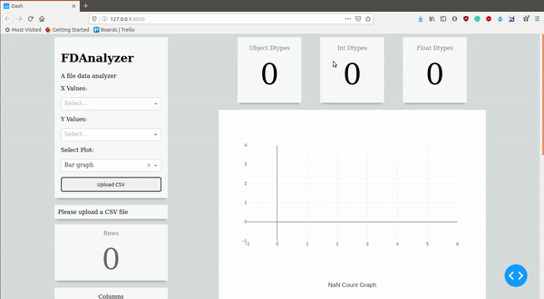

# FDAnalyzer: File Data Analyzer
FDAnalyzer a flask web application based on dash framework. This project helps you to view your csv files and make visualization via confusion matrix, scatter, bar plots and line graphs. More to add soon!!

The main focus of this project was to create an open source tool for visualizing kaggle competition's dataset, so that we can get a quick jest of how each feature is related and some basic stats. This will not only help to get a good head start in competition but also would help to understand data in a better way. As I have learned from my past kaggle past expeirnces `

> **The better we understand the data, easier it would be to reach to the end**

Here is one simple demo of this tool which is reading
[PUBG Dataset](https://www.kaggle.com/c/pubg-finish-placement-prediction):

## Frameworks/libs/tools used
1. [Dash](https://plot.ly/dash/)
2. [Flask memory caching via Redis](https://flask-caching.readthedocs.io/en/latest/)
3. Pandas
4. Emacs

##  Launching the app

    sudo systemctl restart redis-server
    python web_dash.py

